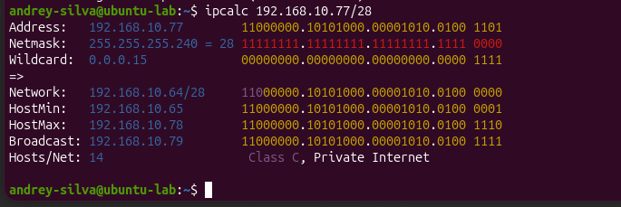
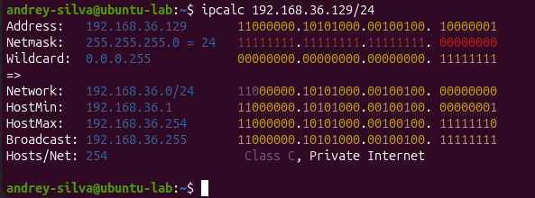
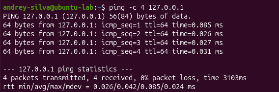
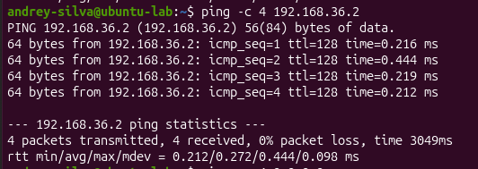
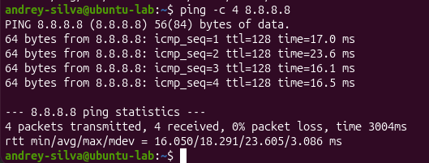
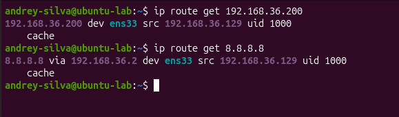

# Lab 02 — Endereçamento IP e Subnetting 🌐

## Objetivo

Compreender o funcionamento do endereçamento IPv4, das máscaras de sub-rede e da notação CIDR, aplicando cálculos de subnetting e analisando como o Linux decide entre comunicação local e roteamento por gateway.

---

## Ambiente utilizado

- Ubuntu Linux em máquina virtual;
- VMware;
- Interface de rede: `ens33`;
- Terminal Linux;
- Ferramentas: `ip`, `ping` e `ipcalc`.

---

## Conceitos estudados

Durante o laboratório, foram praticados os seguintes conceitos:

- endereço IPv4;
- endereços públicos e privados;
- máscara de sub-rede;
- notação CIDR;
- endereço de rede;
- primeiro e último host;
- endereço de broadcast;
- gateway padrão;
- loopback;
- cálculo de hosts utilizáveis;
- divisão de redes em sub-redes;
- roteamento local e externo.

---

## 1. Identificação da configuração de rede

Para visualizar as interfaces e os endereços configurados, foi utilizado:

```bash
ip addr
```

A interface ativa da máquina virtual foi identificada como `ens33`, com a seguinte configuração:

| Elemento | Valor |
|---|---|
| Interface | `ens33` |
| IPv4 | `192.168.36.129/24` |
| Máscara | `255.255.255.0` |
| Rede | `192.168.36.0/24` |
| Gateway | `192.168.36.2` |
| Broadcast | `192.168.36.255` |
| Primeiro host | `192.168.36.1` |
| Último host | `192.168.36.254` |
| Hosts utilizáveis | `254` |

O endereço `192.168.36.129` é privado, pois pertence à faixa:

```text
192.168.0.0 até 192.168.255.255
```

O endereço `127.0.0.1` pertence à interface de loopback e representa a comunicação da máquina com ela mesma.

---

## 2. Análise da tabela de rotas

Para visualizar as rotas configuradas, foi utilizado:

```bash
ip route
```

A rota padrão identificada foi:

```text
default via 192.168.36.2 dev ens33
```

Isso significa que os pacotes destinados a redes externas são encaminhados ao gateway `192.168.36.2` por meio da interface `ens33`.

A rota:

```text
192.168.36.0/24 dev ens33
```

indica que a rede `192.168.36.0/24` está diretamente conectada à máquina.

---

## 3. Máscara de sub-rede e CIDR

Um endereço IPv4 possui 32 bits. A notação CIDR informa quantos desses bits identificam a rede.

Em uma rede `/24`:

```text
24 bits identificam a rede
8 bits identificam os hosts
```

O cálculo da quantidade de hosts utilizáveis é:

```text
2^(32 - CIDR) - 2
```

Para uma rede `/24`:

```text
2^(32 - 24) - 2
2^8 - 2
256 - 2 = 254 hosts utilizáveis
```

Dois endereços são reservados:

- um para identificar a rede;
- um para o broadcast.

---

## 4. Comparação entre prefixos CIDR

| CIDR | Máscara | Bits de host | Endereços totais | Hosts utilizáveis |
|---|---|---:|---:|---:|
| `/24` | `255.255.255.0` | 8 | 256 | 254 |
| `/25` | `255.255.255.128` | 7 | 128 | 126 |
| `/26` | `255.255.255.192` | 6 | 64 | 62 |
| `/27` | `255.255.255.224` | 5 | 32 | 30 |
| `/28` | `255.255.255.240` | 4 | 16 | 14 |

Quanto maior o prefixo CIDR, mais bits são utilizados para identificar a rede e menos bits permanecem disponíveis para os hosts.

---

## 5. Cálculo de subnetting

Foi analisado o seguinte endereço:

```text
192.168.10.77/28
```

A máscara `/28` corresponde a:

```text
255.255.255.240
```

O tamanho do bloco foi calculado da seguinte maneira:

```text
256 - 240 = 16
```

As sub-redes avançam de 16 em 16:

```text
.0, .16, .32, .48, .64, .80, .96...
```

Como o endereço `.77` está entre `.64` e `.79`, os resultados são:

| Elemento | Resultado |
|---|---|
| Rede | `192.168.10.64/28` |
| Primeiro host | `192.168.10.65` |
| Último host | `192.168.10.78` |
| Broadcast | `192.168.10.79` |
| Hosts utilizáveis | `14` |

O cálculo foi validado com:

```bash
ipcalc 192.168.10.77/28
```

### Evidência



---

## 6. Análise da rede local com ipcalc

A configuração real da máquina também foi analisada:

```bash
ipcalc 192.168.36.129/24
```

A ferramenta apresentou o endereço de rede, a máscara, a faixa de hosts, o broadcast e a quantidade de hosts utilizáveis.

### Evidência



---

## 7. Testes de conectividade

Foram realizados testes em três níveis: loopback, gateway e conectividade externa.

### 7.1 Teste de loopback

```bash
ping -c 4 127.0.0.1
```

Esse teste verificou o funcionamento da pilha TCP/IP da própria máquina.

O resultado apresentou quatro pacotes enviados, quatro recebidos e nenhuma perda.



### 7.2 Teste do gateway

```bash
ping -c 4 192.168.36.2
```

Esse teste confirmou a comunicação da máquina virtual com o gateway da rede local.

O resultado apresentou quatro pacotes enviados, quatro recebidos e nenhuma perda.



### 7.3 Teste de conectividade externa

```bash
ping -c 4 8.8.8.8
```

Esse teste verificou o acesso a uma rede externa sem depender da resolução DNS.

O resultado apresentou quatro pacotes enviados, quatro recebidos e nenhuma perda.



---

## 8. Comparação entre roteamento local e externo

Para analisar a decisão de roteamento do Linux, foram utilizados:

```bash
ip route get 192.168.36.200
```

```bash
ip route get 8.8.8.8
```

O endereço `192.168.36.200` pertence à mesma rede `/24` da máquina. Por isso, foi acessado diretamente pela interface `ens33`.

O endereço `8.8.8.8` está fora da rede local. Por isso, o tráfego foi encaminhado por meio do gateway `192.168.36.2`.

A presença da palavra `via` indica que o pacote precisa passar por um gateway para alcançar o destino.

### Evidência



---

## 9. Análise dos resultados

Os testes demonstraram que:

- a pilha TCP/IP local estava funcionando;
- a máquina conseguia se comunicar com o gateway;
- existia conectividade com uma rede externa;
- não ocorreu perda de pacotes nos testes;
- destinos da mesma sub-rede eram acessados diretamente;
- destinos externos eram enviados ao gateway padrão;
- redes menores disponibilizam menos endereços para hosts.

A latência do teste externo foi maior que a do gateway e do loopback, pois os pacotes precisaram percorrer outras redes até chegar ao destino.

---

## 10. Aprendizados obtidos

Com este laboratório, aprendi a:

- identificar o IPv4 de uma máquina Linux;
- diferenciar IP, rede, gateway, broadcast e loopback;
- interpretar a notação CIDR;
- calcular a quantidade de hosts disponíveis;
- calcular o tamanho do bloco de uma sub-rede;
- encontrar rede, primeiro host, último host e broadcast;
- validar cálculos utilizando o `ipcalc`;
- testar diferentes níveis de conectividade;
- interpretar perda de pacotes e latência;
- compreender como o Linux escolhe uma rota local ou externa.

---

## Conclusão

O laboratório permitiu relacionar os cálculos de subnetting com o funcionamento real da rede de uma máquina Linux.

Foi possível observar que a máscara e o prefixo CIDR determinam quais endereços pertencem à mesma sub-rede. Quando o destino está na rede local, a comunicação ocorre diretamente pela interface. Quando está em outra rede, o tráfego é encaminhado ao gateway padrão.

Esses conhecimentos formam uma base importante para diagnóstico de redes, análise de tráfego, configuração de firewalls e atividades de Segurança da Informação.
