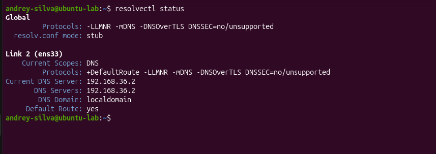
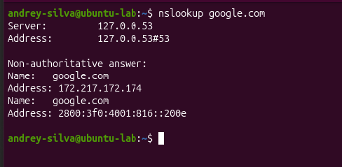
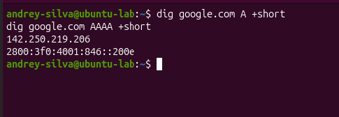
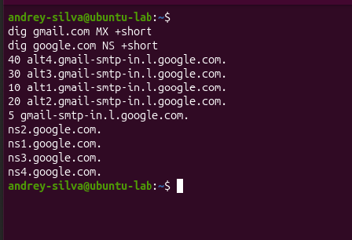
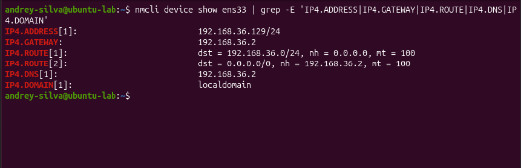
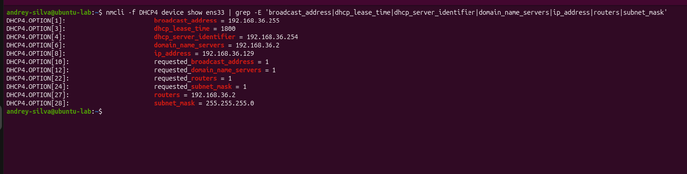
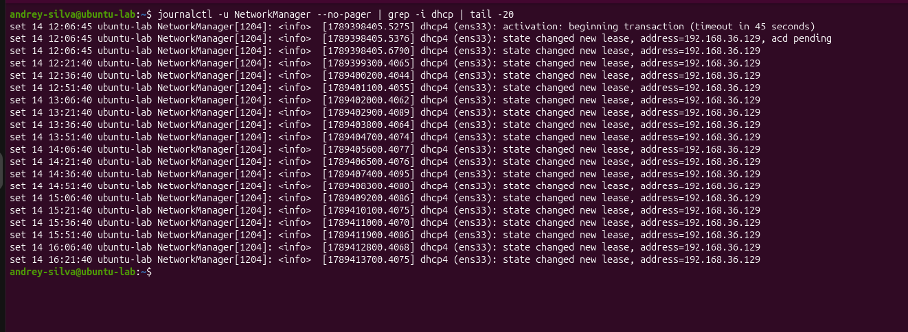

# Lab 03 — DNS e DHCP

## Objetivo

Compreender o funcionamento do DNS e do DHCP por meio da identificação dos servidores utilizados pela máquina virtual, realização de consultas DNS e análise da configuração de rede recebida automaticamente.

---

## Ambiente utilizado

* Ubuntu Linux em máquina virtual
* Interface de rede `ens33`
* NetworkManager
* systemd-resolved
* Terminal Linux

---

## Ferramentas utilizadas

* `resolvectl`
* `nslookup`
* `dig`
* `nmcli`
* `journalctl`

---

## Conceitos praticados

* Resolução de nomes;
* resolvedor DNS local;
* servidor DNS;
* registros A e AAAA;
* registros MX e NS;
* configuração automática de rede;
* servidor DHCP;
* concessão e renovação de endereço IP;
* processo DORA;
* diferença entre servidor DHCP, gateway e DNS.

---

## 1. Identificação do servidor DNS

O primeiro passo foi consultar o estado do serviço de resolução de nomes:

```bash
resolvectl status
```

A saída mostrou que a interface `ens33` utiliza o servidor DNS:

```text
192.168.36.2
```

Também foi analisada a configuração presente no arquivo `/etc/resolv.conf`:

```bash
grep -E '^(nameserver|options|search)' /etc/resolv.conf
```

O arquivo apresentou o endereço:

```text
127.0.0.53
```

Esse endereço pertence ao resolvedor DNS local do `systemd-resolved`. As aplicações enviam suas consultas para `127.0.0.53`, que encaminha as solicitações ao servidor DNS configurado na interface, neste caso `192.168.36.2`.

### Evidências




---

## 2. Consulta DNS com nslookup

Foi realizada uma consulta ao domínio `google.com`:

```bash
nslookup google.com
```

O comando apresentou o servidor consultado e os endereços associados ao domínio.

O `nslookup` fornece uma resposta resumida e é útil para verificar rapidamente se a resolução de nomes está funcionando.

### Evidência



---

## 3. Consulta de registros A e AAAA

Foram consultados separadamente os registros IPv4 e IPv6 do domínio:

```bash
dig google.com A +short
dig google.com AAAA +short
```

O registro `A` associa um nome de domínio a um endereço IPv4.

O registro `AAAA` associa um nome de domínio a um endereço IPv6.

Os endereços retornados podem mudar porque grandes serviços utilizam vários servidores e mecanismos de distribuição de tráfego.

### Evidência



---

## 4. Consulta de registros MX e NS

### Registro MX

Foi consultado o registro MX do domínio `gmail.com`:

```bash
dig gmail.com MX +short
```

Os registros MX indicam quais servidores são responsáveis pelo recebimento de e-mails de um domínio.

Os números apresentados antes dos nomes dos servidores representam suas prioridades. Quanto menor o número, maior é a preferência daquele servidor.

### Registro NS

Também foram consultados os servidores autoritativos do domínio `google.com`:

```bash
dig google.com NS +short
```

Os registros NS indicam quais servidores de nomes possuem autoridade sobre as informações DNS de um domínio.

### Evidência



---

## 5. Configuração IPv4 recebida automaticamente

A configuração da interface `ens33` foi verificada com:

```bash
nmcli device show ens33 | grep -E 'IP4.ADDRESS|IP4.GATEWAY|IP4.ROUTE|IP4.DNS|IP4.DOMAIN'
```

Foram identificados os seguintes dados:

| Configuração                | Valor               |
| --------------------------- | ------------------- |
| Endereço da máquina virtual | `192.168.36.129/24` |
| Rede local                  | `192.168.36.0/24`   |
| Gateway padrão              | `192.168.36.2`      |
| Servidor DNS                | `192.168.36.2`      |
| Domínio de busca            | `localdomain`       |

A rota `0.0.0.0/0` representa a rota padrão. O tráfego destinado a redes não presentes na tabela de rotas é encaminhado para o gateway `192.168.36.2`.

### Evidência



---

## 6. Análise da concessão DHCP

Os detalhes da concessão DHCP foram consultados com:

```bash
nmcli -f DHCP4 device show ens33
```

As principais informações encontradas foram:

| Informação          | Valor            |
| ------------------- | ---------------- |
| Endereço concedido  | `192.168.36.129` |
| Máscara de sub-rede | `255.255.255.0`  |
| Broadcast           | `192.168.36.255` |
| Servidor DHCP       | `192.168.36.254` |
| Gateway padrão      | `192.168.36.2`   |
| Servidor DNS        | `192.168.36.2`   |
| Tempo da concessão  | `1800 segundos`  |

O tempo de `1800` segundos corresponde a 30 minutos.

O servidor DHCP é `192.168.36.254`, enquanto o gateway e o servidor DNS utilizam `192.168.36.2`. Isso demonstra que esses serviços possuem funções diferentes e não precisam utilizar o mesmo endereço.

### Evidência



---

## 7. Histórico e renovação da concessão

O histórico do DHCP foi consultado utilizando:

```bash
journalctl -u NetworkManager --no-pager | grep -i dhcp | tail -20
```

Os registros mostraram que o endereço `192.168.36.129` foi mantido e renovado periodicamente.

Como a concessão possui duração de 30 minutos, a máquina tenta renová-la aproximadamente na metade desse período, ou seja, depois de cerca de 15 minutos.

A utilização de um endereço dinâmico não significa que ele mudará em todas as renovações. O servidor DHCP pode renovar a concessão mantendo o mesmo endereço.

### Evidência



---

## 8. Processo DORA

A atribuição inicial de um endereço por DHCP normalmente segue quatro etapas, conhecidas como DORA:

1. **Discover:** o cliente procura servidores DHCP disponíveis.
2. **Offer:** o servidor oferece um endereço e outras configurações.
3. **Request:** o cliente solicita a configuração oferecida.
4. **Acknowledge:** o servidor confirma a concessão.

De maneira simplificada:

```text
Cliente: existe algum servidor DHCP?
Servidor: sim, posso oferecer este endereço.
Cliente: solicito esse endereço.
Servidor: concessão confirmada.
```

Os registros analisados mostraram o início da transação e a concessão do endereço. Os quatro pacotes DORA não foram capturados individualmente neste laboratório.

---

## Resultados

Durante o laboratório foi possível:

* Identificar o resolvedor DNS local;
* localizar o servidor DNS utilizado pela interface;
* realizar consultas com `nslookup` e `dig`;
* diferenciar registros A, AAAA, MX e NS;
* identificar uma configuração recebida automaticamente;
* localizar o servidor DHCP;
* verificar o tempo da concessão;
* observar as renovações periódicas do endereço;
* diferenciar as funções de DHCP, gateway e DNS.

---

## Conclusão

Este laboratório permitiu compreender como DNS e DHCP participam da comunicação em rede.

O DNS traduz nomes de domínio em endereços IP e também disponibiliza outros registros relacionados aos serviços de um domínio. O DHCP automatiza a configuração de rede, fornecendo informações como endereço IP, máscara, gateway e servidor DNS.

Também foi possível observar que o servidor DHCP, o gateway e o servidor DNS desempenham funções diferentes, mesmo quando alguns desses serviços utilizam o mesmo endereço em um ambiente virtualizado.

Com essa prática, foi desenvolvida uma base importante para futuros estudos de análise de tráfego, diagnóstico de rede e segurança da informação.
