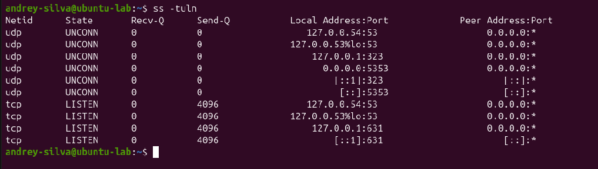
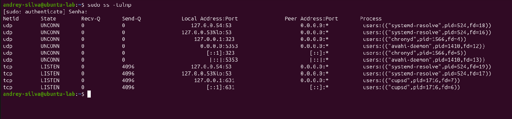
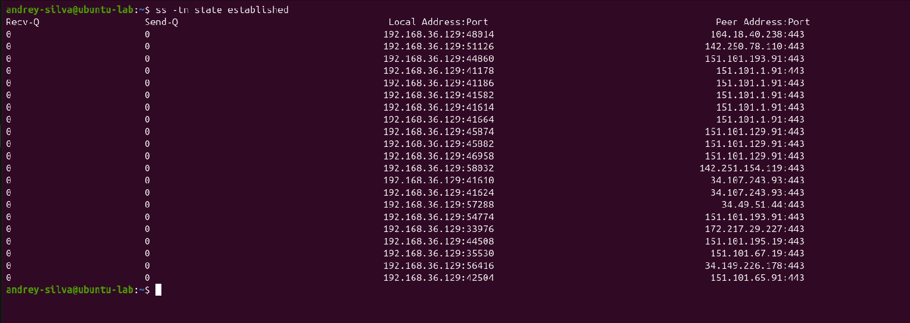
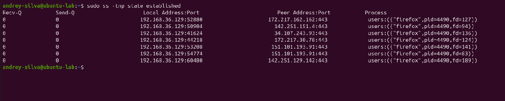
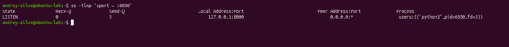
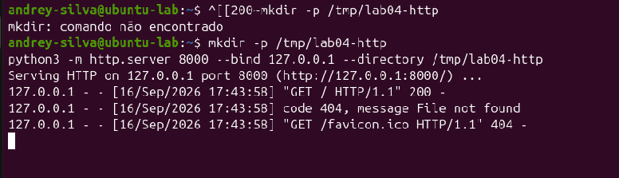
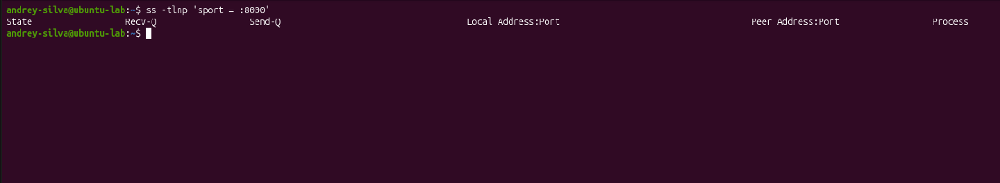

# Lab 04 — Portas, Serviços e Protocolos

## Objetivo

Identificar portas e serviços no Linux, relacionar conexões aos processos responsáveis e compreender as diferenças entre TCP, UDP, HTTP e HTTPS.

## Ambiente e ferramentas

- Ubuntu em máquina virtual.
- Interface de rede: `ens33`.
- Endereço IPv4 da VM: `192.168.36.129/24`.
- Ferramentas: `ss`, Python 3 e Firefox.

## 1. Identificação de portas TCP e UDP

Executei o comando:

```bash
ss -tuln
```

Significado das opções:

| Opção | Função |
|---|---|
| `-t` | Exibir sockets TCP. |
| `-u` | Exibir sockets UDP. |
| `-l` | Mostrar sockets em escuta ou aguardando tráfego. |
| `-n` | Mostrar endereços e portas numericamente. |

Na saída, observei sockets TCP no estado `LISTEN` e sockets UDP no estado `UNCONN`.

- **LISTEN:** aguardando novas conexões TCP.
- **UNCONN:** socket UDP sem um destinatário fixo associado; isso não impede o envio e o recebimento de mensagens.

Também identifiquei diferentes endereços locais:

| Endereço | Significado |
|---|---|
| `127.0.0.1` | Loopback IPv4: a própria máquina. |
| `127.0.0.53` e `127.0.0.54` | Endereços de loopback utilizados pelo resolvedor DNS local. |
| `0.0.0.0` | Na coluna de endereço local, representa todas as interfaces IPv4. |
| `[::1]` | Loopback IPv6. |
| `[::]` | Na coluna de endereço local, representa todas as interfaces IPv6. |

Um serviço associado ao loopback fica acessível somente dentro da própria máquina. Escutar em todas as interfaces não comprova que o serviço esteja acessível pela internet, pois isso também depende da rede e do firewall.



## 2. Identificação dos processos responsáveis

Para relacionar os sockets aos processos, executei:

```bash
sudo ss -tulnp
```

A opção `-p` acrescenta informações sobre os processos. O `sudo` permite visualizar também processos de outros usuários.

Identifiquei os seguintes serviços:

| Processo | Porta e transporte observados | Função |
|---|---|---|
| `systemd-resolve` | 53/TCP e 53/UDP | Resolução DNS local. |
| `chronyd` | 323/UDP | Interface de monitoramento e controle do Chrony. |
| `avahi-daemon` | 5353/UDP | Descoberta de serviços na rede local por mDNS. |
| `cupsd` | 631/TCP | Serviço de impressão. |

A porta `323/UDP` observada pertence à interface de controle do Chrony. O protocolo NTP normalmente utiliza a porta `123/UDP`.



## 3. Análise de conexões TCP estabelecidas

Com o navegador em uso, executei:

```bash
ss -tn state established
```

Esse comando filtra conexões TCP estabelecidas.

Uma das conexões observadas foi:

```text
Local:  192.168.36.129:48014
Remoto: 104.18.40.238:443
```

Nesse exemplo:

- `192.168.36.129` é o endereço da VM.
- `48014` é a porta local temporária utilizada nessa conexão.
- `104.18.40.238` é o endereço remoto.
- `443` é a porta remota, normalmente associada a HTTPS.

As colunas `Recv-Q` e `Send-Q` estavam zeradas, indicando ausência de dados pendentes nessas filas no instante da observação.



## 4. Associação das conexões ao Firefox

Para descobrir o programa responsável pelas conexões, executei:

```bash
sudo ss -tnp state established
```

As sete conexões exibidas nessa consulta pertenciam ao processo `firefox`, com PID `4490`.

Observei que um mesmo processo pode manter várias conexões simultâneas, inclusive com um mesmo endereço remoto, utilizando portas locais diferentes.

O número da porta ajuda na investigação, mas sozinho não confirma o protocolo utilizado nem a legitimidade de uma conexão.



## 5. Criação de um servidor HTTP local

Criei uma pasta temporária e iniciei um servidor HTTP com Python:

```bash
mkdir -p /tmp/lab04-http
python3 -m http.server 8000 --bind 127.0.0.1 --directory /tmp/lab04-http
```

Configuração utilizada:

- **Porta:** `8000`.
- **Endereço:** `127.0.0.1`, restringindo o acesso à própria VM.
- **Diretório disponibilizado:** `/tmp/lab04-http`.

Mantive o servidor em execução e, em outro terminal, consultei:

```bash
ss -tlnp 'sport = :8000'
```

O resultado mostrou:

```text
LISTEN  0  5  127.0.0.1:8000  0.0.0.0:*  users:(("python3",pid=6050,fd=3))
```

Confirmei que o processo `python3` estava aguardando conexões TCP na porta `8000`.

O campo remoto `0.0.0.0:*` não representa acesso por todas as interfaces. Nesse socket em escuta, indica que não há um cliente remoto específico associado.



## 6. Acesso HTTP e interpretação dos registros

No Firefox da VM, acessei:

```text
http://127.0.0.1:8000/
```

O servidor registrou:

```text
"GET / HTTP/1.1" 200 -
"GET /favicon.ico HTTP/1.1" 404 -
```

Interpretação:

| Registro | Significado |
|---|---|
| `GET /` | Solicitação da página inicial. |
| `200` | Solicitação atendida com sucesso. |
| `GET /favicon.ico` | Solicitação do ícone da aba do navegador. |
| `404` | Arquivo solicitado não encontrado. |

O erro `404` ocorreu na solicitação do ícone e não impediu o acesso à página inicial.

Esse teste relacionou o processo `python3`, a porta TCP `8000` e as solicitações HTTP feitas pelo navegador.



## 7. Encerramento do serviço

Encerrei o servidor com `Ctrl+C` no terminal em que o Python estava executando.

Depois, repeti:

```bash
ss -tlnp 'sport = :8000'
```

O comando mostrou apenas o cabeçalho, sem o socket em `LISTEN`. Ao atualizar a página no Firefox, o navegador não conseguiu conectar.

Assim, confirmei que encerrar o processo removeu a escuta desse serviço na porta `8000`.



## Conceitos consolidados

- **TCP:** estabelece conexões e oferece entrega ordenada, com retransmissão de dados perdidos.
- **UDP:** envia mensagens sem estabelecer conexão e não garante, por si só, entrega ou ordem. Quando necessário, a aplicação implementa confirmação e novas tentativas.
- **HTTP:** protocolo utilizado pelo servidor criado no exercício.
- **HTTPS:** utiliza HTTP protegido por TLS. Alterar somente a porta para `443` não ativa essa proteção.
- **Porta e processo:** a opção `-p` do `ss` permite identificar o processo responsável por um socket.

## Conclusão

Neste laboratório, pratiquei a identificação de portas, serviços, processos e conexões no Linux.

A criação de um servidor HTTP local permitiu acompanhar o ciclo completo de um serviço: iniciar, entrar em escuta, receber solicitações, registrar respostas e encerrar.

Esses conhecimentos ajudam a investigar serviços expostos e conexões de aplicações, servindo como base para os próximos exercícios de análise de tráfego e segurança de redes.
