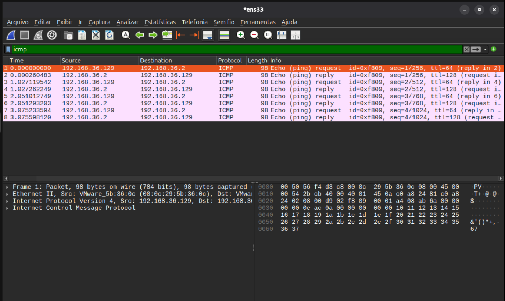
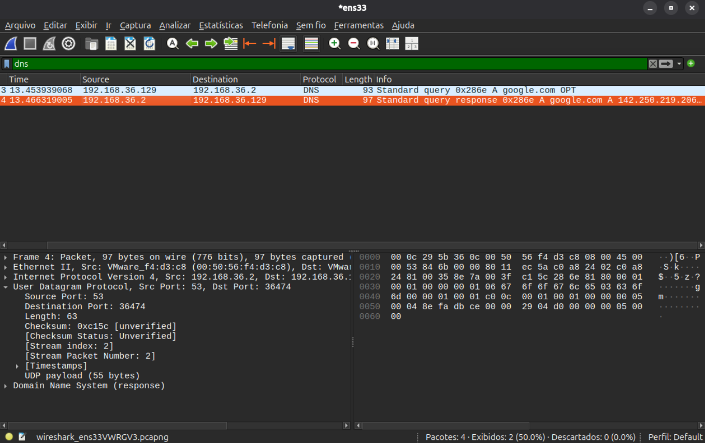
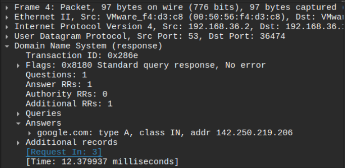
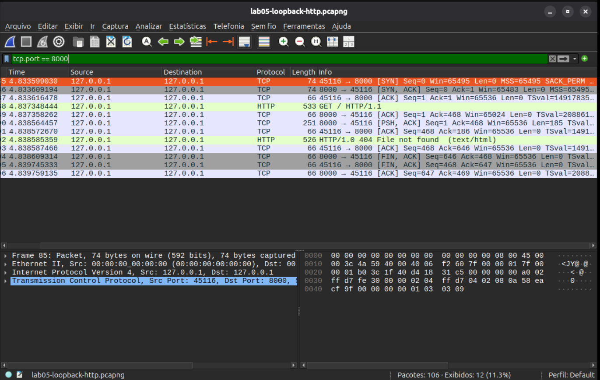
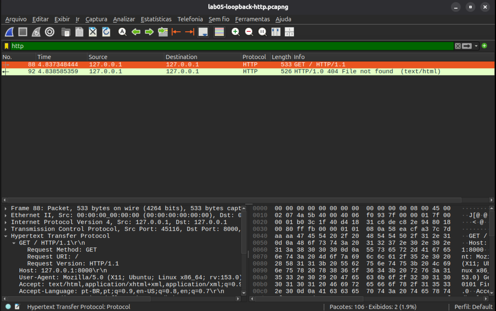
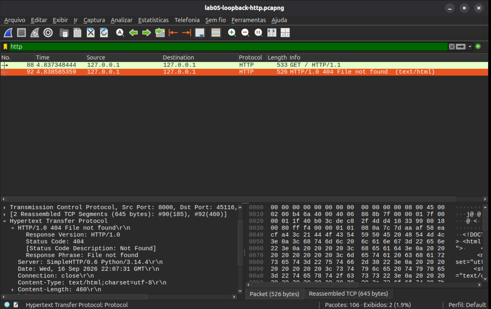

# Lab 05 — Análise de Tráfego com Wireshark

## Objetivo

Utilizar o Wireshark para capturar e analisar pacotes de rede, identificando protocolos, endereços IP, portas, solicitações, respostas e o estabelecimento de conexões TCP.

## Ambiente e ferramentas

- Ubuntu em máquina virtual.
- Interface de rede: `ens33`.
- Interface de loopback: `lo`.
- Endereço IPv4 da VM: `192.168.36.129`.
- Gateway e servidor DNS utilizado: `192.168.36.2`.
- Ferramentas: Wireshark, `ping`, `dig`, Python 3 e Firefox.

O Wireshark foi instalado com:

```bash
sudo apt update
sudo apt install wireshark
```

Também configurei o usuário para realizar capturas sem executar a interface gráfica como `root`:

```bash
sudo usermod -aG wireshark "$USER"
```

Após reiniciar a sessão da máquina virtual, a interface gráfica do Wireshark passou a reconhecer as interfaces `ens33` e `lo`.

## 1. Captura de pacotes ICMP

Para gerar tráfego ICMP, executei:

```bash
ping -c 4 192.168.36.2
```

A captura foi realizada na interface `ens33`. No Wireshark, utilizei o filtro:

```text
icmp
```

A análise mostrou os pedidos e as respostas do `ping`:

| Mensagem | Origem | Destino |
|---|---|---|
| Echo Request | `192.168.36.129` | `192.168.36.2` |
| Echo Reply | `192.168.36.2` | `192.168.36.129` |

Ao expandir o protocolo ICMP, identifiquei:

- `Type 8`: Echo Request.
- `Type 0`: Echo Reply.

Esses valores identificam mensagens ICMP e não representam portas TCP ou UDP.



## 2. Captura e análise de uma consulta DNS

Para gerar uma consulta DNS direcionada ao servidor `192.168.36.2`, executei:

```bash
dig @192.168.36.2 google.com A
```

O tipo `A` solicita o endereço IPv4 associado ao domínio.

No Wireshark, utilizei o filtro:

```text
dns
```

A captura mostrou:

- Uma consulta `Standard query`.
- Uma resposta `Standard query response`.
- Origem da consulta: `192.168.36.129`.
- Destino da consulta: `192.168.36.2`.

Na camada UDP, observei:

```text
Source Port: 36474
Destination Port: 53
```

A porta `36474` era temporária e foi utilizada pela VM. A porta `53` pertence ao serviço DNS.



## 3. Portas na resposta DNS

Na resposta DNS, as portas apareceram invertidas:

```text
Source Port: 53
Destination Port: 36474
```

Isso representa a resposta retornando do servidor DNS para a porta temporária da VM:

```text
VM: 36474 → DNS: 53
DNS: 53 → VM: 36474
```



## 4. Endereço IPv4 retornado pelo DNS

Na seção `Answers` da resposta DNS, identifiquei o registro:

```text
google.com: type A, class IN, addr 142.250.219.206
```

O endereço `142.250.219.206` foi o IPv4 retornado para `google.com` naquela consulta. Esse endereço pode variar em consultas diferentes, pois grandes serviços utilizam vários servidores e endereços.

## 5. Criação de um servidor HTTP local

Para gerar tráfego TCP e HTTP dentro da própria VM, criei uma pasta temporária:

```bash
mkdir -p /tmp/lab04-http
```

Depois iniciei um servidor HTTP com Python:

```bash
python3 -m http.server 8000 --bind 127.0.0.1 --directory /tmp/lab04-http
```

Configurações utilizadas:

- Porta: `8000`.
- Endereço: `127.0.0.1`.
- Interface de captura: `lo` ou Loopback.
- Diretório disponibilizado: `/tmp/lab04-http`.

No Firefox, acessei:

```text
http://127.0.0.1:8000/
```

## 6. Estabelecimento da conexão TCP

No Wireshark, utilizei o filtro:

```text
tcp.port == 8000
```

A captura mostrou o estabelecimento da conexão TCP em três etapas:

| Etapa | Comunicação | Função |
|---|---|---|
| `SYN` | Porta temporária → `8000` | Cliente solicita iniciar a conexão. |
| `SYN, ACK` | `8000` → Porta temporária | Servidor aceita e confirma. |
| `ACK` | Porta temporária → `8000` | Cliente confirma a resposta. |

Na captura, os endereços de origem e destino eram:

```text
127.0.0.1 → 127.0.0.1
```

Isso ocorreu porque a comunicação foi realizada pela interface de loopback, dentro da própria VM.

Também observei pacotes `FIN, ACK`, utilizados no encerramento da conexão TCP.



## 7. Análise da requisição HTTP

Para visualizar somente os pacotes HTTP, utilizei o filtro:

```text
http
```

Ao selecionar o pacote `GET / HTTP/1.1`, identifiquei:

```text
Request Method: GET
Request URI: /
Host: 127.0.0.1:8000
```

O método `GET` indica que o navegador solicitou um recurso ao servidor. O URI `/` representa a página inicial.



## 8. Análise da resposta HTTP

Na resposta do servidor, identifiquei:

```text
Response Version: HTTP/1.0
Status Code: 404
Response Phrase: File not found
```

O código HTTP `404` significa que o servidor recebeu a solicitação, mas não encontrou o recurso solicitado.

Esse resultado pertence à camada HTTP. A conexão TCP foi estabelecida corretamente antes da resposta HTTP ser enviada.



## Conceitos consolidados

- O Wireshark permite observar pacotes individualmente e analisar seus campos.
- O ICMP utiliza mensagens como `Echo Request` e `Echo Reply`.
- O ICMP não utiliza portas TCP ou UDP.
- O DNS utiliza a porta `53`.
- A porta temporária é usada pelo cliente para enviar a consulta e receber a resposta.
- O TCP inicia uma conexão com a sequência `SYN`, `SYN, ACK` e `ACK`.
- O HTTP utiliza métodos como `GET` para solicitar recursos.
- O código `404` indica que o servidor não encontrou o recurso solicitado.
- A interface `ens33` foi usada para observar a comunicação com o gateway e o DNS.
- A interface `lo` foi usada para observar a comunicação local entre o Firefox e o servidor Python.

## Arquivos de captura

Durante o laboratório, também foram salvos arquivos de captura no formato `.pcapng`, que podem ser reabertos posteriormente no Wireshark para novas análises.

## Conclusão

Neste laboratório, pratiquei a captura e a análise de tráfego de rede utilizando o Wireshark.

Observei pacotes ICMP, consultas DNS, portas UDP, o estabelecimento de conexões TCP e solicitações HTTP. A atividade permitiu relacionar os conceitos estudados nos laboratórios anteriores com os pacotes reais transmitidos pela máquina virtual.

O laboratório também mostrou como identificar o protocolo, a origem, o destino, as portas envolvidas e o resultado de uma comunicação, habilidades importantes para diagnóstico de redes e análise de segurança.

## Referências

- [Wireshark — Capture Privileges](https://wiki.wireshark.org/capturesetup/captureprivileges)
- [Python — HTTP Server](https://docs.python.org/3/library/http.server.html)
