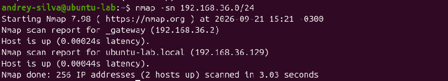
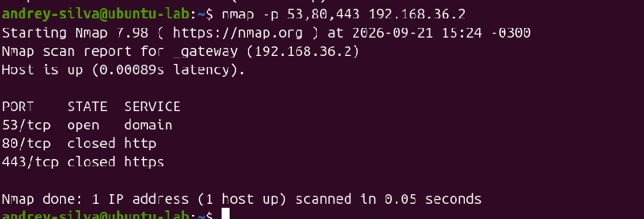
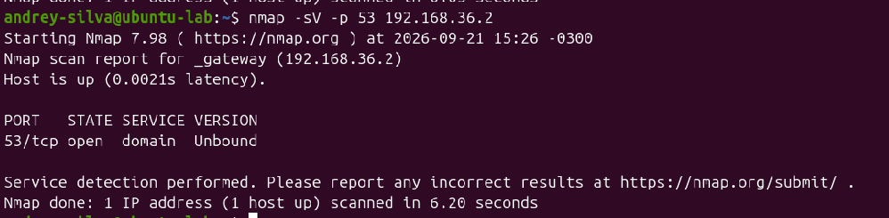
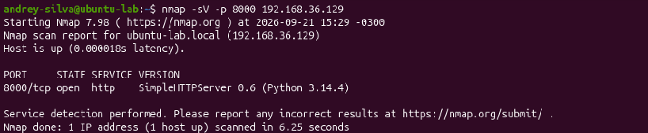
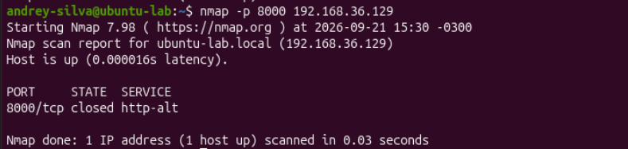
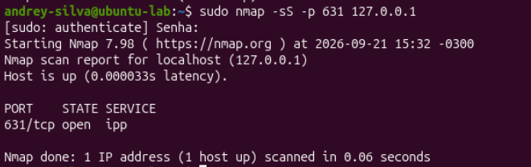
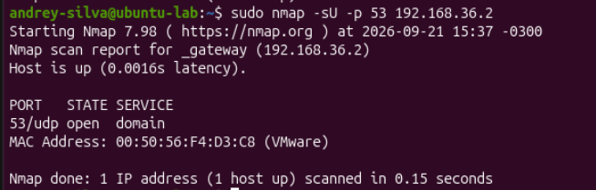
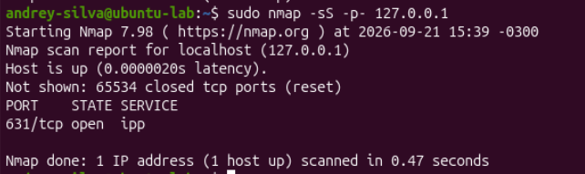

# Laboratório 06 — Nmap e Descoberta de Rede

## Objetivo

Este laboratório teve como objetivo praticar o uso do Nmap para descoberta de dispositivos, identificação de portas abertas, reconhecimento de serviços e análise da exposição de aplicações em uma rede privada controlada.

Todas as varreduras foram realizadas somente na máquina virtual Ubuntu e na rede virtual do VMware.

## Ambiente utilizado

* Ubuntu Linux em máquina virtual;
* VMware;
* Interface de rede: `ens33`;
* IPv4 da máquina: `192.168.36.129/24`;
* Gateway e servidor DNS: `192.168.36.2`;
* Rede analisada: `192.168.36.0/24`;
* Nmap 7.98;
* Python 3.14.4.

## Instalação e verificação do Nmap

O Nmap foi instalado utilizando:

```bash
sudo apt update
sudo apt install nmap -y
```

A versão instalada foi verificada com:

```bash
nmap --version
```

## Identificação do endereço da máquina

O endereço da interface `ens33` foi consultado com:

```bash
ip -br addr show ens33
```

Resultado identificado:

```text
ens33 UP 192.168.36.129/24
```

O endereço IPv4 da máquina era `192.168.36.129`, pertencente à rede privada `192.168.36.0/24`.

## Verificação inicial do localhost

A primeira varredura foi realizada no endereço de loopback:

```bash
nmap 127.0.0.1
```

O Nmap encontrou a porta `631/tcp` aberta e associada ao serviço `ipp`.

Para confirmar qual processo estava utilizando essa porta, foi executado:

```bash
sudo ss -tlnp 'sport = :631'
```

O resultado mostrou que a porta era utilizada pelo processo `cupsd`, relacionado ao serviço de impressão CUPS.

Também foi observado que o CUPS estava escutando somente nos endereços de loopback:

```text
127.0.0.1:631
[::1]:631
```

Ao examinar o endereço `192.168.36.129`, a porta não apareceu aberta, demonstrando que o serviço estava acessível somente pela própria máquina.

## Descoberta de hosts na rede

Foi realizada uma varredura de descoberta na rede virtual:

```bash
nmap -sn 192.168.36.0/24
```

O parâmetro `-sn` realiza a descoberta de hosts ativos sem examinar suas portas.

Foram encontrados dois dispositivos ativos:

* `192.168.36.2` — gateway da rede virtual;
* `192.168.36.129` — máquina virtual Ubuntu.



## Verificação de portas específicas no gateway

Foram examinadas as portas TCP `53`, `80` e `443` do gateway:

```bash
nmap -p 53,80,443 192.168.36.2
```

Resultado:

* `53/tcp open` — serviço DNS disponível;
* `80/tcp closed` — nenhum serviço HTTP escutando;
* `443/tcp closed` — nenhum serviço HTTPS escutando.



Uma porta aberta indica que existe uma aplicação aceitando conexões. Uma porta fechada indica que o host respondeu, mas não existe aplicação escutando naquela porta.

## Identificação do serviço e da versão

Para identificar o software responsável pelo serviço DNS, foi utilizado o parâmetro `-sV`:

```bash
nmap -sV -p 53 192.168.36.2
```

O Nmap identificou o software **Unbound** na porta `53/tcp`.



O parâmetro `-sV` envia sondas adicionais para tentar identificar o serviço e sua versão.

## Criação de um serviço HTTP controlado

Foi criado um servidor HTTP temporário na porta `8000`:

```bash
mkdir -p /tmp/lab06-http
python3 -m http.server 8000 --bind 192.168.36.129 --directory /tmp/lab06-http
```

Com o servidor em execução, foi realizada a seguinte varredura:

```bash
nmap -sV -p 8000 192.168.36.129
```

O Nmap identificou:

```text
8000/tcp open http SimpleHTTPServer 0.6 (Python 3.14.4)
```



Esse teste demonstrou que uma porta aberta pode revelar o protocolo, a aplicação e até sua versão.

## Comparação após o encerramento do serviço

O servidor Python foi encerrado com:

```text
Ctrl + C
```

A porta foi examinada novamente:

```bash
nmap -p 8000 192.168.36.129
```

Após o encerramento da aplicação, o resultado mudou para:

```text
8000/tcp closed http-alt
```



A comparação demonstrou que uma porta permanece aberta somente enquanto existe uma aplicação escutando nela.

## Varredura TCP SYN

Foi realizada uma varredura SYN na porta `631` do localhost:

```bash
sudo nmap -sS -p 631 127.0.0.1
```

O parâmetro `-sS` envia um pacote TCP com a flag `SYN` e analisa a resposta:

* `SYN, ACK` indica uma porta aberta;
* `RST` indica uma porta fechada;
* Ausência de resposta ou bloqueio pode indicar uma porta filtrada.



Essa técnica exige privilégios administrativos porque o Nmap precisa criar e manipular pacotes diretamente.

## Varredura UDP do DNS

Como o DNS pode utilizar TCP e UDP, foi realizada uma varredura UDP:

```bash
sudo nmap -sU -p 53 192.168.36.2
```

O resultado confirmou que a porta `53/udp` também estava aberta:

```text
53/udp open domain
```

O Nmap também identificou o endereço MAC do gateway como pertencente ao VMware.



O parâmetro `-sU` é utilizado para examinar portas UDP.

## Varredura completa de portas TCP

Para examinar todas as 65.535 portas TCP do localhost, foi utilizado:

```bash
sudo nmap -sS -p- 127.0.0.1
```

O parâmetro `-p-` determina que todas as portas sejam examinadas.

O resultado apresentou:

* 65.535 portas TCP examinadas;
* 65.534 portas fechadas;
* Apenas a porta `631/tcp` aberta.



## Salvamento do resultado em arquivo

O resultado de uma varredura foi salvo em formato de texto com:

```bash
nmap -sV -p 53,80,443 192.168.36.2 -oN nmap-gateway.txt
```

O arquivo foi visualizado utilizando:

```bash
cat nmap-gateway.txt
```

O parâmetro `-oN` salva a saída no formato normal do Nmap, permitindo registrar os resultados para documentação e comparação.

## Principais parâmetros utilizados

| Parâmetro | Função                                     |
| --------- | ------------------------------------------ |
| `-sn`     | Descobrir hosts ativos sem examinar portas |
| `-p`      | Definir portas específicas                 |
| `-sV`     | Identificar serviços e versões             |
| `-sS`     | Realizar varredura TCP SYN                 |
| `-sU`     | Realizar varredura UDP                     |
| `-p-`     | Examinar todas as 65.535 portas            |
| `-oN`     | Salvar o resultado em arquivo de texto     |

## Estados de portas

| Estado     | Significado                                            |
| ---------- | ------------------------------------------------------ |
| `open`     | Existe uma aplicação escutando e aceitando conexões    |
| `closed`   | O host respondeu, mas não existe aplicação escutando   |
| `filtered` | Um firewall ou filtro impediu a determinação do estado |

## Aprendizados

Durante o laboratório, foi possível compreender que:

* O Nmap pode descobrir dispositivos ativos em uma rede;
* Uma porta aberta está relacionada a uma aplicação em execução;
* Uma porta fechada não significa que o equipamento esteja desligado;
* Serviços vinculados ao loopback não ficam diretamente expostos à rede;
* A detecção de versão pode revelar informações importantes sobre uma aplicação;
* TCP e UDP precisam ser examinados separadamente;
* Uma varredura padrão não representa necessariamente todas as 65.535 portas;
* Os resultados podem ser salvos em arquivos para documentação;
* Varreduras devem ser realizadas somente em sistemas próprios ou expressamente autorizados.

## Conclusão

O laboratório apresentou os principais recursos do Nmap para descoberta de rede e identificação de serviços. Também demonstrou, na prática, a diferença entre portas abertas e fechadas por meio da criação e do encerramento controlado de um servidor HTTP.

Esses conhecimentos são importantes para administração de redes, inventário de ativos, análise de exposição e atividades defensivas em segurança da informação.
