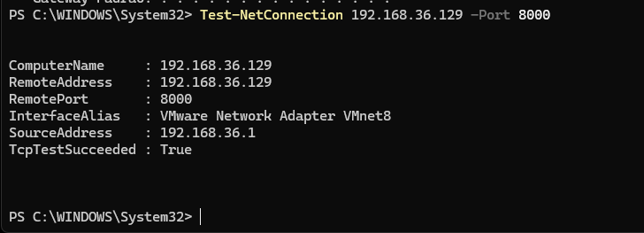
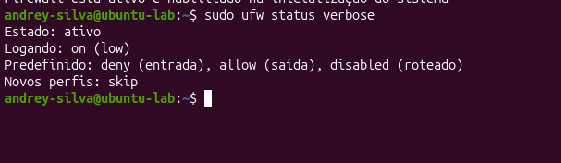
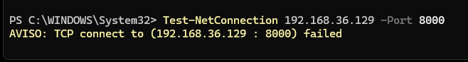
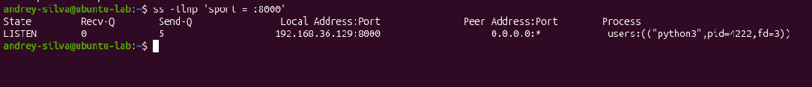
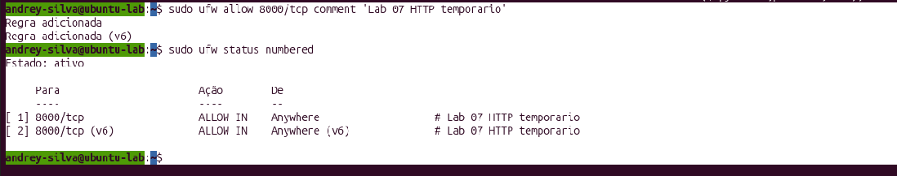
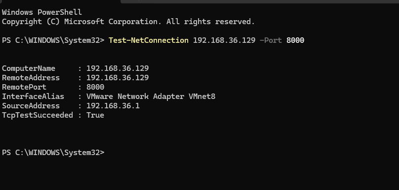
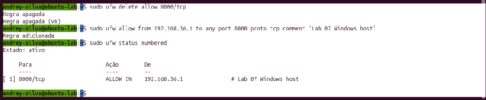
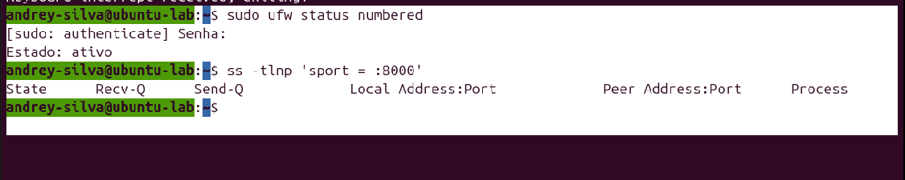

# Lab 07 — Firewall e Controle de Tráfego

## Objetivo

Praticar a configuração de um firewall no Ubuntu utilizando o UFW, observando como as regras de entrada alteram o acesso aos serviços de rede.

O laboratório demonstrou a diferença entre:

- serviço disponível;
- porta bloqueada pelo firewall;
- porta liberada por regra;
- acesso permitido somente para uma origem específica.

---

## Ambiente utilizado

- Ubuntu em máquina virtual VMware
- Windows como máquina cliente
- Interface de rede: `ens33`
- IP do Ubuntu: `192.168.36.129`
- IP do Windows na VMnet8: `192.168.36.1`
- Firewall utilizado: UFW
- Serviço temporário: servidor HTTP Python
- Porta utilizada: `8000/tcp`

---

## 1. Teste inicial sem firewall

Foi iniciado um servidor HTTP temporário no Ubuntu:

```bash
mkdir -p /tmp/lab07-http
python3 -m http.server 8000 --bind 192.168.36.129 --directory /tmp/lab07-http
```

No Windows, foi realizado o teste de conexão:

```powershell
Test-NetConnection 192.168.36.129 -Port 8000
```

O resultado foi positivo:

```text
TcpTestSucceeded : True
```



---

## 2. Ativação do UFW

O firewall foi configurado com as seguintes políticas:

```bash
sudo ufw default deny incoming
sudo ufw default allow outgoing
sudo ufw logging on
sudo ufw enable
```

Essa configuração significa:

- conexões de entrada são bloqueadas por padrão;
- conexões de saída são permitidas;
- o registro de eventos foi ativado;
- o firewall foi habilitado na inicialização do sistema.

A configuração foi verificada com:

```bash
sudo ufw status verbose
```



---

## 3. Teste com a porta bloqueada

Com o UFW ativo e sem nenhuma regra permitindo a porta 8000, foi realizado novamente o teste no Windows:

```powershell
Test-NetConnection 192.168.36.129 -Port 8000
```

O resultado foi:

```text
TcpTestSucceeded : False
```

A conexão foi bloqueada pelo firewall.



Mesmo com o bloqueio externo, o servidor continuava ouvindo localmente na porta 8000:

```bash
ss -tlnp 'sport = :8000'
```



Isso demonstra que o serviço continuava funcionando, mas o firewall impedia o acesso externo.

---

## 4. Liberação geral da porta 8000

Foi criada uma regra permitindo conexões TCP de entrada na porta 8000:

```bash
sudo ufw allow 8000/tcp comment 'Lab 07 HTTP temporario'
```

A regra foi conferida com:

```bash
sudo ufw status numbered
```



Nesse momento, a porta estava liberada para qualquer origem alcançável pela rede.

O teste no Windows retornou:

```text
TcpTestSucceeded : True
```



---

## 5. Restrição por endereço IP de origem

Para aplicar o princípio do menor privilégio, a regra geral foi removida:

```bash
sudo ufw delete allow 8000/tcp
```

Em seguida, foi criada uma regra permitindo o acesso somente ao IP do Windows:

```bash
sudo ufw allow from 192.168.36.1 to any port 8000 proto tcp comment 'Lab 07 Windows host'
```

A regra foi conferida com:

```bash
sudo ufw status numbered
```

Resultado:

```text
[ 1] 8000/tcp ALLOW IN 192.168.36.1
```



O Windows continuou conseguindo acessar a porta, pois seu endereço estava autorizado.

O princípio aplicado foi o do menor privilégio: permitir somente o acesso necessário, para a origem necessária.

---

## 6. Limpeza das regras temporárias

Após a conclusão dos testes, a regra específica foi removida:

```bash
sudo ufw delete allow from 192.168.36.1 to any port 8000 proto tcp
```

O servidor HTTP temporário também foi encerrado com:

```text
Ctrl + C
```

---

## 7. Verificação final

Foi realizada a validação final do firewall e da porta:

```bash
sudo ufw status numbered
```

```bash
ss -tlnp 'sport = :8000'
```

Resultado final:

- UFW permanece ativo;
- não existem regras temporárias para a porta 8000;
- nenhum processo está ouvindo na porta 8000.



---

## Conceitos aprendidos

- O UFW é uma interface simplificada para gerenciamento do firewall do Linux.
- `deny incoming` bloqueia conexões de entrada por padrão.
- `allow outgoing` permite conexões iniciadas pelo próprio sistema.
- Uma porta pode estar em funcionamento, mas bloqueada externamente pelo firewall.
- `TcpTestSucceeded : False` indica que a conexão foi bloqueada ou não pôde ser estabelecida.
- `TcpTestSucceeded : True` indica que a conexão foi permitida.
- `Anywhere` permite acesso de qualquer origem.
- Restringir uma regra a um IP específico reduz a superfície de ataque.
- O princípio do menor privilégio permite somente os acessos necessários.
- Regras temporárias devem ser removidas após a conclusão de um laboratório.

---

## Conclusão

Neste laboratório, foi configurado e testado um firewall no Ubuntu utilizando o UFW.

Foi possível observar, na prática, como uma mesma porta pode apresentar comportamentos diferentes conforme as regras aplicadas:

1. acessível quando o firewall estava desativado;
2. bloqueada pelo `deny incoming`;
3. liberada por uma regra geral;
4. liberada somente para um endereço IP específico;
5. removida após a conclusão dos testes.

A configuração final deixou o firewall ativo, com conexões de entrada bloqueadas por padrão e sem regras temporárias abertas.
